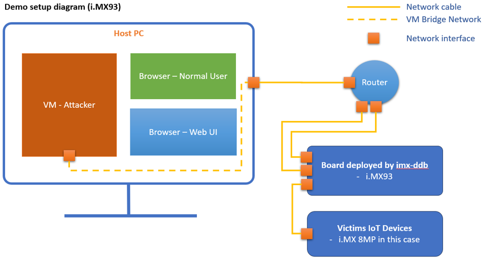
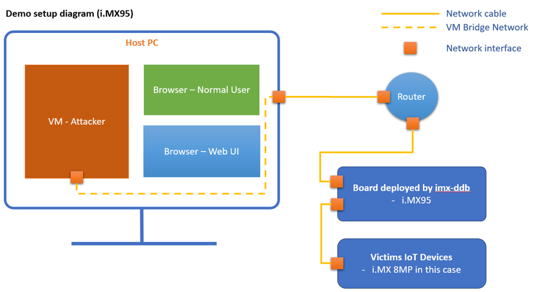

# i.MX DDoS Blocker: DDoS attack blocker system based on ML model and DPDK


<!----- Boards ----->
[]()
[]()
[]()
[]()
[]()
[](https://mcuxpresso.nxp.com/appcodehub?category=networking)
[](https://mcuxpresso.nxp.com/appcodehub?category=aiml)


Distributed Denial of Service, or DDoS is one of the forms of cyber attack. The attacker floods a server with large number of network packets to prevent normal users from accessing connected online servers.
i.MX DDoS Blocker PoC is designed to prevent DDoS attacks on edge network.

To detect the DDoS attack, we used a machine learning model to analyze the network traffic passing through. The advantage of machine learning is that we don’t need to design rule to detect anomalous packets for different network. We can just feed the model with anomalous samples and normal samples, and the model can learn from them and be trained to detect DDoS attack.

To speed up the packets extraction and forwarding, we introduce DPDK library in this PoC. DPDK is a library that can enhance network application performance. It can let CPU actively poll the network device in user space and bypass the Linux kernel network protocol stack. And another benefit of using DPDK is that you can have full control over the network packets. Therefore, we can block the anomalous packets immediately.

i.MX DDoS Blocker can be used for Edge network firewall, automotive gateway and telematics.

## Table of Contents
1. [Software](#step1)
2. [Hardware](#step2)
3. [Setup](#step3)
4. [Results](#step4)
5. [FAQs](#step5) 
6. [Support](#step6)
7. [Release Notes](#step7)

## 1. Software<a name="step1"></a>
This demo depends on DPDK which has been included in default Linux BSP. But if you would like to build DPDK application, you need to configure cross compiling environmnet on host machine. More details, please refer [DPDK/nxp](https://github.com/NXP/dpdk/tree/22.11-qoriq/nxp).

In `sample-dataset` folder, you can see the dataset for training and test. The `sources` folder contains ML model, feature extraction and webUI code.

## 2. Hardware<a name="step2"></a>
The following hardware should be prepared for this demo:

- i.MX93 or i.MX95 evk (for i.MX DDoS Blocker system running)
- another Linux board (acts as victim)
- Laptop (acts as attacker in VM and shows WebUI)
- Monitor (24-inch 1080p is best for display)
- Network cables (at least 2)

For i.MX93, the connection situation is shown in the figure:


For i.MX95, the connection situation is shown in the figure:


## 3. Setup<a name="step3"></a>
### Linux host setup
The imx-ddb requires specific Python and Tensorflow version. Under different version, especially different Tensorflow version, some API may be not adaptable and you should modify code based on corresponding version. Therefore, we recommend using conda to manage Python and its package versions.

Miniconda is used for creating isolated Python env to train and convert model.
This documentation can guide you to install miniconda on your Linux server: https://docs.conda.io/en/latest/miniconda.html#.

Once you have completed the installation, you can create a new env and install required Python packages by running:
```
conda create -n imx-ddb python=3.9
conda activate imx-ddb

pip3 install -r sources/model/requirements.txt
```


### Model training
[lucid-ddos](https://github.com/doriguzzi/lucid-ddos/) is chosen as DDoS attack detection model in this project.
And we used public DDoS attacker dataset to train ML model. By default, it was [CIC-DDoS2019](https://www.unb.ca/cic/datasets/ddos-2019.html) and we also pushed it in sample-dataset folder.


```
cd sources/model
# preprocess dataset
python3 lucid_dataset_parser_dpkt.py -d ../../sample-dataset
# load dataset to train model
python3 lucid_cnn.py -t ../../sample-dataset -e 200
```

### Convert TF model to TFlite
Execute the following command to quantize the model, which can let it run in the TFlite on the board.
```
python3 lucid_convert.py ../../output/LUCID-ddos-CIC2019.h5 ../../output/LUCID-ddos-CIC2019-quant-int8.tflite ../../sample-dataset/dataset_train.hdf5
```

### Make l2capfwd
To make l2capfwd from source, you need to install toolchain and DPDK SDK on your Linux server.
This [README](https://github.com/NXP/dpdk/blob/22.11-qoriq/nxp/README) may guide you to complete these work.

After that, the PKG_CONFIG_PATH and toolchain path in `sources/env_setup_imx95`(for i.MX95) or `sources/env_setup`(for i.MX93) should be modified based on your environment.

Now, let environment variables effective:
```
source env_setup_imx95
```

Make it:
```
cd sources
make
```

If the path is correct and DPDK and toolchain are installed properly, you will get `l2capfwd` and `test` ELF file for aarch64 under `build` folder.


### Deploy to board
Before you continue, please make sure that model has been trained and converted properly and l2fwd is ready.

#### Generate software packages
Generate software packeages for board. It copies model, configuration files, libraries and applications to target folder.Then you can conveniently copy this target folder to board's rootfs, for example `/home/root/imx-ddb`
```bash
./generate_delivery.sh
```

#### Board environment setup

Enter u-boot to configure DPDK for i.MX95:
```
u-boot> edit mmcargs
edit: setenv bootargs ${cpuidle} ${jh_clk} ${mcore_args} console=${console} root=${mmcroot} default-hugepagesz=2m hugepagesz=2m hugepages=448 iommu.passthrough=1 mem=4096M

u-boot> saveenv
u-boot> boot
```

When first running it on default Linux BSP, you should install Flask, a lightweight WSGI web application framework for Python, to support for WebUI.
```bash
pip install Flask==3.1.0
```

#### Start up imx-ddb
Then, start up the demo on i.MX boards:
```bash
./run_demo.sh
```

It will create a VF and bind it with DPDK.
Then, start three processes: l2capfwd, AI inference and WebUI.

Users can access WebUI via `http://<board_ip>:5000`.

## 4. Results<a name="step4"></a>
On laptop's VM, user can execute DDoS attack command to victim board. After i.MX DDoS Bloker detecting, the attack packets should be blocked and the normal packets to victim's web server should be transmitted.


## 5. FAQs<a name="step5"></a>


## 6. Support<a name="step6"></a>


Questions regarding the content/correctness of this example can be entered as Issues within this GitHub repository.

>**Warning**: For more general technical questions regarding NXP Microcontrollers and the difference in expected functionality, enter your questions on the [NXP Community Forum](https://community.nxp.com/)

[](https://www.youtube.com/NXP_Semiconductors)
[](https://www.linkedin.com/company/nxp-semiconductors)
[](https://www.facebook.com/nxpsemi/)
[](https://x.com/NXP)

## 7. Release Notes<a name="step7"></a>
| Version | Description / Update                           | Date                        |
|:-------:|------------------------------------------------|----------------------------:|
| 1.0     | Initial release on Application Code Hub        | May 14<sup>th</sup> 2025 |

## Licensing
This demo is licensed under the "LA_OPT_NXP_Software_License v56 April 2024".
