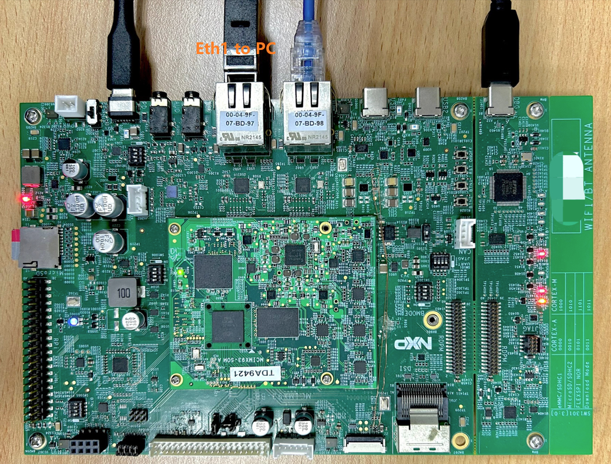
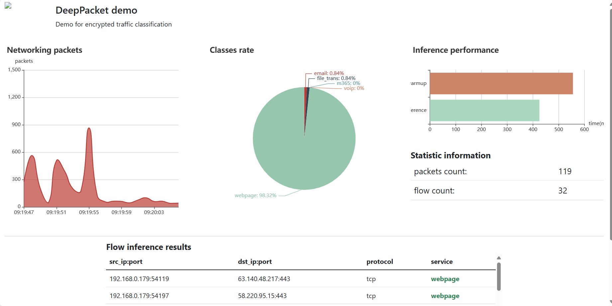

# DeepPacket: Encrypted network packets classification system

<!----- Boards ----->

This project demonstrates a system for classifying encrypted network traffic to identify the types of services being transmitted. Acting as a Layer 2 (L2) bridge, the system captures and forwards network packets on i.MX platform.

Key Features:
- Packet Capture & Forwarding: Operates as an L2 bridge to intercept and forward network traffic.
- Feature Extraction: Extracts multiple features from the captured packets for analysis.
- Machine Learning Inference: Utilizes a trained ML model to classify packets into service categories.
- NPU Acceleration: Supports Neural Processing Unit (NPU) integration to accelerate inference and reduce CPU load.
This tool is useful for network monitoring, traffic analysis, and enhancing visibility into encrypted communications without decrypting the payload.

Currently, it supports 5 network service categories. They are:
- File Transfer
- Web Browsing
- VoIP
- Email
- Microsoft Office

## Table of Contents
1. [Software](#step1)
2. [Hardware](#step2)
3. [Setup](#step3)
4. [Results](#step4)
5. [FAQs](#step5) 
6. [Support](#step6)
7. [Release Notes](#step7)

## 1. Software

### Source code structure
The root directory of this repository contains 2 folders. `WebSys` is web UI code and does not include ML and packets handle code. `deepPacket` includes core code files. It contains packets extraction, model training and inference code.

Other files in root directory are license, documentation and useful scripts which help run this demo.

### Software dependency
To run this demo, you need to prepare the following software:
- Linux BSP for i.MX93 or i.MX95
- Tcpdump

This demo depends on libpcap to capture network packets from network device and depends on Flask to create a WebUI server. For libpcap installation, you can refer to [Setup](#step3). For Flask and other Python libraries installation, [Setup](#step3) presents how to install them using the `setup_env.sh` script.

## 2. Hardware
The following hardware should be prepared for this demo:
- i.MX93 or i.MX95 EVK
- Laptop (for executing commands and simulating user actions)
- Monitor (24-inch 1080p is best for display)
- Network cables (at least 2)
- Router (for Internet access. If not convenient to use Ethernet interface to access the Internet, you can use a 4G router)

**If you use i.MX93Auto EVK**, you also need TJA1103 as the second network port. Because there is only one Phy and RJ45 connector on i.MX93Auto EVK. Alternatively, a USB network card can also work.

## 3. Setup

You can download the BSP from [NXP website](https://www.nxp.com/design/design-center/software/embedded-software/i-mx-software/embedded-linux-for-i-mx-applications-processors:IMXLINUX). 

Here is the configuration on the i.MX93 boards. The configuration on PC is omitted.
For i.MX95 CPU, it is similar to the following steps. Currently, the i.MX95 NPU is not supported.

### Step 1: hardware connectivity
Connect network cable between PC and `eth1` on i.MX93. Then, connect network cable between Internet and `eth0` on i.MX93. 

### Step 2: libraries installation
Run `run_demo.sh setup` the first time to install python package and create the required folders. 

### Step 3: tcpdump installation
`tcpdump` is a command-line tool for network traffic capture and analysis. The installation is a bit cumbersome on i.MX platform. There are two ways to install it, source code and Yocto.

#### tcpdump installation from source code
You need to download the following source code in order and compile it directly on board:
	- flex
	- bison
	- libpcap
	- tcpdump

#### tcpdump installation from Yocto
Refer to *i.MX Yocto Project User's Guide* and setup the Yocto environmnet for i.MX.
Build `.deb` package for tcpdump: `bitbake tcpdump`.

Copy the `.deb` package file to the board and execute `dpkg -i <tcpdump-xxx>.deb`.

You can verify the installation using `tcpdump --version` on the board.

### Step 4: software setup
Run `./run_demo.sh start` to start the demo.

This script will create a bridge to forward eth0 and eth1. At the same time, it will create a virtual interface veth0 for debugging and displaying of results. If all goes well, your PC should now be able to access the Internet through i.MX93.

Now, you can access the report webpage by `http://<board_veth0_ip>:5000` in your PC browser.

The model may experience concept drift problem, so different training sets should be used to update the model for different network environments.

## 4. Results
You can see the network traffic analysis report on WebUI.

## 5. FAQs
Q: How to train the model?

A: Before training the model, a dataset of captured packets should be prepared. It is usually a set of pcap files captured by tcpdump or wireshark. Then, `deepPacket/preprocess.py` need to be run with correct options and output feature vectors stored as `.npy` format. After that, refer to `train_main()` in `deepPacket/main.py`. 

## 6. Support

Questions regarding the content/correctness of this example can be entered as Issues within this GitHub repository.

>**Warning**: For more general technical questions regarding NXP Microcontrollers and the difference in expected functionality, enter your questions on the [NXP Community Forum](https://community.nxp.com/)

## 7. Release Notes
| Version | Description / Update                           | Date                        |
|:-------:|------------------------------------------------|----------------------------:|
| 1.0     | Initial release on Application Code Hub        | May 8th 2025 |

## Licensing
This demo is licensed under the "LA_OPT_NXP_Software_License v56 April 2024".

The DeepPacket model is based on this paper:

> Lotfollahi, Mohammad, et al. "Deep packet: A novel approach for encrypted traffic classification using deep learning." Soft Computing 24.3 (2020): 1999-2012.
