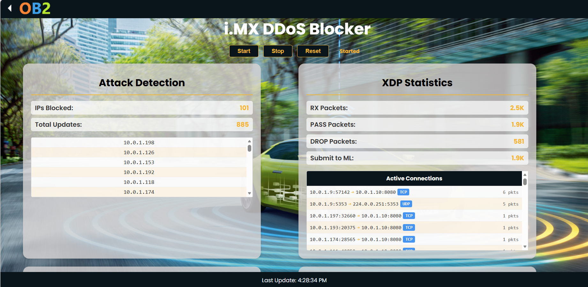
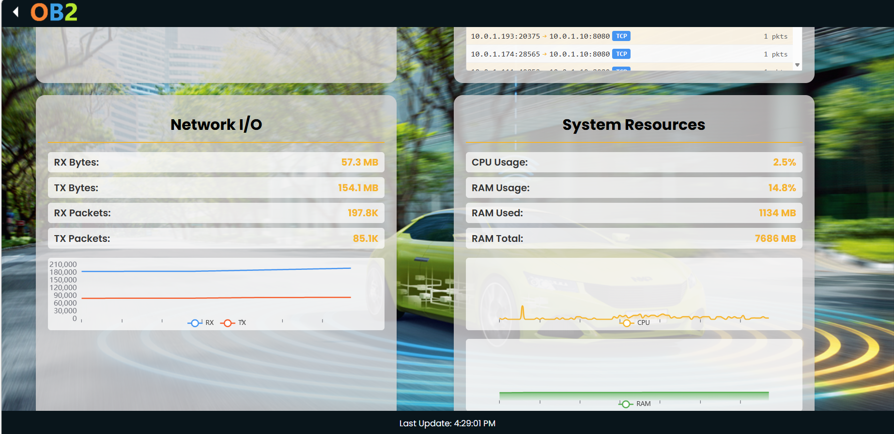

# How to run on OrangeBox2.0 board

**You can start from the step 3 if you do not want to train the model**. This repository also provides a pre-trained model in `output` folder.

## Step 1: Model training
Setup the training environment:
```bash
pip3 install -r sources/requirements-for-pc.txt
```

Tr­ain the mod­el us­ing the pro­vid­ed train­ing script:
```bash
cd sources/ml_detector
python3 model_manager.py -m lucid_cnn -t ../../sample-dataset -e 200
```

**Only lucid_cnn model is supported for now**

## Step 2: Model quan­ti­za­tion and con­ver­sion

Convert to TFLite model:
```
python3 model_manager.py -c ../../output/LUCID-CNN-ddos-CIC2019.keras ../../output/LUCID-CNN-ddos-CIC2019-quant-int8.tflite ../../sample-dataset/dataset_train.hdf5
```

Download eiq-neutron-sdk from [here](https://www.nxp.com/design/design-center/software/eiq-ai-development-environment/eiq-toolkit-for-end-to-end-model-development-and-deployment:EIQ-TOOLKIT)

```bash
export LD_LIBRARY_PATH=<your eiq path>/eiq-neutron-sdk-linux-3.0.1/lib

cd bin

./neutron-converter --input <your imx-ddb path>/output/LUCID-CNN-ddos-CIC2019-quant-int8.tflite --target imx943 --output <your imx-ddb path>/output/LUCID-CNN-ddos-CIC2019-quant-int8-imx943-npu.tflite --min-num-ops-per-graph 1 --dump-statistics --verbose
```

## Step 3: Build board deploy package

### Build environment
**LLVM-21**
The LLVM-21 and clang-21 need to be installed on your host system.
```bash
wget https://apt.llvm.org/llvm.sh
chmod +x llvm.sh
sudo ./llvm.sh 21

apt update
apt install -y llvm-21 clang-21 lld-21 lldb-21

update-alternatives --install /usr/bin/llvm-link llvm-link /usr/bin/llvm-link-21 100
update-alternatives --install /usr/bin/clang clang /usr/bin/clang-21 100
update-alternatives --install /usr/bin/llc llc /usr/bin/llc-21 100

llvm-link --version
clang --version
```

**Yocto Toolchain**
Install the yocto toolchain in your host syste­m.

### Build steps
Set the TOOLCHAIN variable, for example:
```bash
TOOLCHAIN_PATH=/opt/fsl-imx-xwayland/6.12-styhead/environment-setup-armv8a-poky-linux ./build_and_install.sh
```

You will get the `board_deploy` folder. Then, copy this folder to the OrangeBox2.0 board.

## Step 4: Setup the demo

### Hardware Setup
Apart from an OB2.0 board, you will also need **another board with two Ethernet interfaces** as the victim and the attacker.
Let's assume that on another board, the two network ports are `eth0` and `eth1` (this is also the current default configuration). We will assign `eth1` to a separate network namespace and run the victim server. The `eth0` will be used by the attacker to send DDoS traffic to the victim.

Connect the network cables as shown below::
```
OB2.0                  Another board
 swp0 -------------------- eth0
 eth1 -------------------- eth1 
 swp1 ---------+
               |
               |
               +---------- Laptop/PC (WebUI)
```

### i.MX DDoS blocker demo startup

On orangebox2.0 board, navigate to the `board_deploy` folder and run:
```bash
python3 run_imx-ddb_webui.py
```

Then open your browser and navigate to `http://<ob2-board-ip>:5000` to access the Web UI.

There are 3 buttons in the webpage: `Start`, `Stop` and `Reset`.
Click the `Start` button to begin DDoS detection. The statis­tics and detection results will be displayed in real-time on the Web UI.

### Perform DDoS attack

You can find a terminal-based control panel for DoS attack simulation and defense testing in `sources/victim_attacker` directory.

Copy this directory to the victim/attacker board and run:
```bash
cd victim_attacker
sudo python3 netns_labctl.py
```
A TUI (Text User Interface) menu will appear with the following options:
```
┌─────────────────────────────────────────────────────────────────────────┐
│  Select operations                                                      │
│                                                                         │
│    1 - Init network namespace lab                                       │
│    2 - Start victim server                                              │
│    3 - Start DoS attack                                                 │
│    4 - Stop DoS attack                                                  │
│    5 - Test victim connection                                           │
│    6 - Exit                                                             │
│                                                                         │
├─────────────────────────────────────────────────────────────────────────┤
│ NetNS: Initialized | Victim Server: Running │ Attacker process: Running |
└─────────────────────────────────────────────────────────────────────────┘
```

Controls
Key	Action
↑ ↓	Navigate menu
Enter	Execute selected option

Workflow:
Init namespace  →  Start server  →  Test connection (will be successful) → Start attack  →  Test connection (will be failed) → Wait for detection on WebUI  →  Test connection (will be successful again) → Exit

### Example
WebUI screenshot showing successful DDoS detection and blocking:




